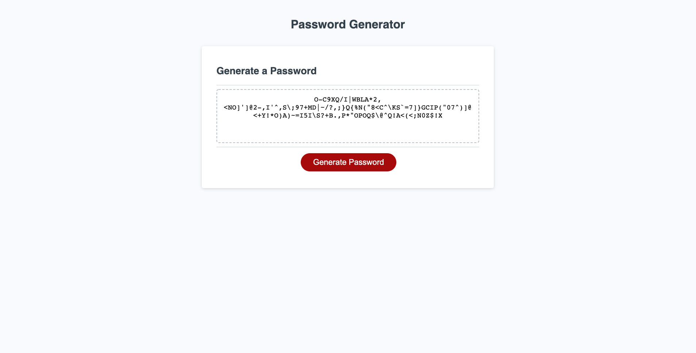

# Password Generator

## Description 

This is a password generator that creates a random password based on user-selected criteria.

## Password Generator Screenshot

## Github Pages Link

You can view the deployed site at https://dpan-5.github.io/hw-03-password-generator/

## Functionality

When the "Generate Password" button is clicked, you are presented with a series of prompts for password criteria:
    - Password length
    - Lower case
    - Upper case
    - Numeric
    - Special characters

The input is validated to ensure a length of at least 8 characters and no more than 128 characters, as well as at least one character type selection. A password is then generated that matches the selected criteria and displayed on the page.

## License

MIT License

Copyright (c) 2020 David Pan

Permission is hereby granted, free of charge, to any person obtaining a copy
of this software and associated documentation files (the "Software"), to deal
in the Software without restriction, including without limitation the rights
to use, copy, modify, merge, publish, distribute, sublicense, and/or sell
copies of the Software, and to permit persons to whom the Software is
furnished to do so, subject to the following conditions:

The above copyright notice and this permission notice shall be included in all
copies or substantial portions of the Software.

THE SOFTWARE IS PROVIDED "AS IS", WITHOUT WARRANTY OF ANY KIND, EXPRESS OR
IMPLIED, INCLUDING BUT NOT LIMITED TO THE WARRANTIES OF MERCHANTABILITY,
FITNESS FOR A PARTICULAR PURPOSE AND NONINFRINGEMENT. IN NO EVENT SHALL THE
AUTHORS OR COPYRIGHT HOLDERS BE LIABLE FOR ANY CLAIM, DAMAGES OR OTHER
LIABILITY, WHETHER IN AN ACTION OF CONTRACT, TORT OR OTHERWISE, ARISING FROM,
OUT OF OR IN CONNECTION WITH THE SOFTWARE OR THE USE OR OTHER DEALINGS IN THE
SOFTWARE.
